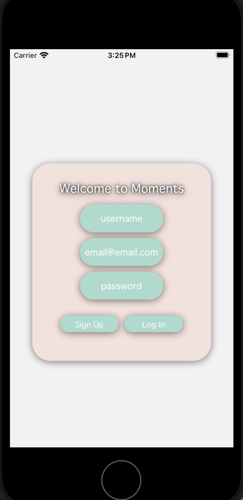
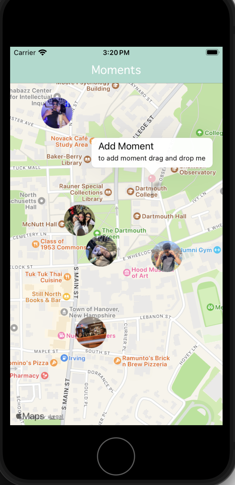
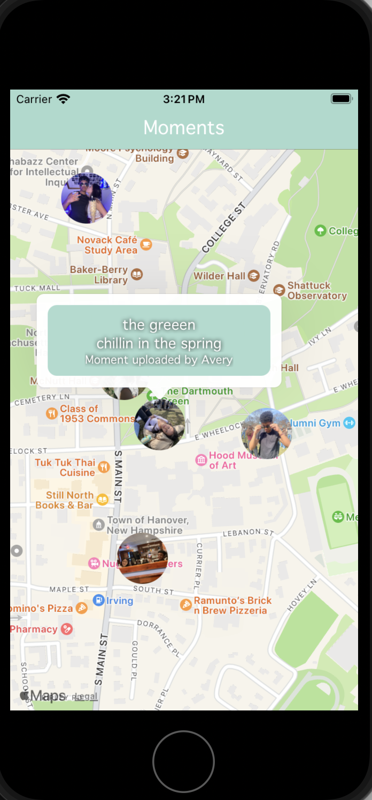
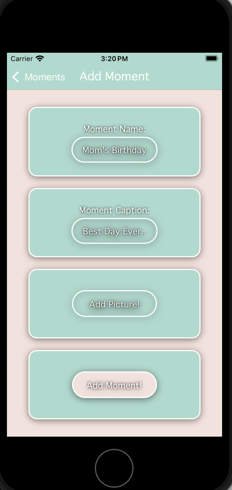

# Moments
## Made By Avery Sutherland April 28 2024

## Description
This App allows it's users to upload pictures from their library to create a new 'Moment'. The moment is then 
placed on a map with the picture selected as the icon and the title and caption of the moment as a callout once the user clicks on the Moment. The user is also noted as the one to have uploaded that moment to the map so other users know who created what moment.

## The Project 
This project was developed with React Native and uses Image Picker, React Stack Navigation, Firebase Storage, Firebase Firestore, Firebase Authentification, and React Native Maps. 

## How to Run Locally 
You will need Expo Go or an IOS simulator. In the terminal run `npx expo start` . The terminal will provide a QR code that you can scan and will take you to the Expo Go app where you can run the app. Alternatively you can press `i` and it will open up your IOS simulator to run the app. PLEASE NOTE - still in development - when adding a moment to the map please allow for the picture to be fully uploaded first before clicking `add moment` as the markers require the image url from firebase storage to be fully uploaded and ready in order to properly make and display the marker on the map. Also note on the signIN screen in order for app to run smoothly all fields are required.

 
 
 
  

### Expo Image Picker 
This allows the user to open thier library on the app and choose which photo they would like to upload for the moment 

### Stack Navigation 
Navigates the user to the corressponding screen upon different user actions.

### Firebase Storage
Stores all the photos the user uploads 

### Firebase Firestore 
Holds the databases of users, markers and their subsequent information to be put on the map 

### Firebase Authentification 
Signs up users and logs in already existing users 

### React Native Maps 
Provides the map and allows for users to interact with the map

